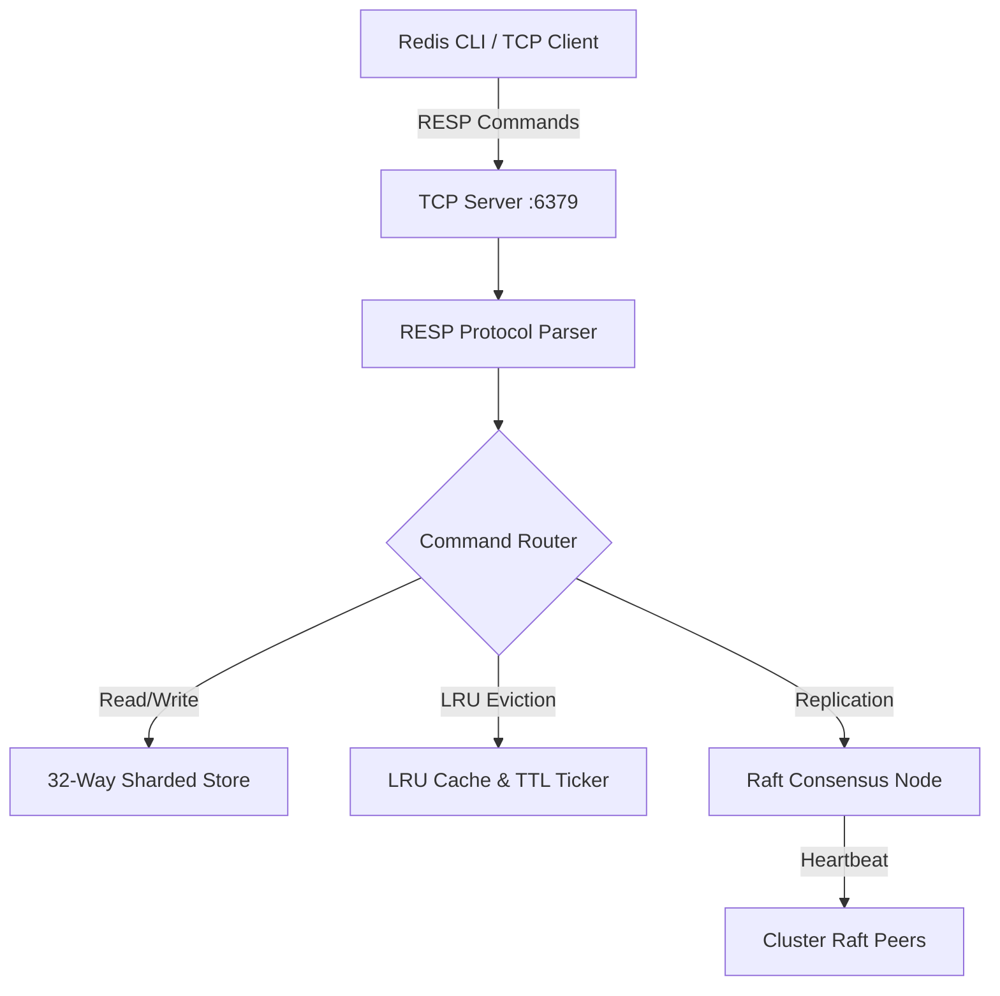

# ⚡ Distributed Cache Engine

[](https://goreportcard.com/report/github.com/shashankshrivastva-hue/distributed-cache-engine)
[](https://opensource.org/licenses/MIT)
[](https://golang.org)

High-performance, in-memory distributed key-value cache built in Go with Raft consensus, 32-way sharded locking, and native Redis RESP protocol compliance.

---

## 🏛️ Architecture



## 🚀 Key Features

- **RESP Protocol Compatibility**: Connect seamlessly via standard `redis-cli` or any language Redis driver.
- **Microsecond Latency**: 32-way memory sharding reduces thread contention across high core counts.
- **LRU Eviction & Precise TTL**: O(1) eviction using doubly-linked list with auto-expiring keys.
- **Raft Consensus Engine**: Built-in state machine for replicated log consistency.

## 🛠️ Usage

```bash
# Build and run
go run cmd/cache-server/main.go

# Connect via standard redis-cli
redis-cli -p 6379
127.0.0.1:6379> SET user:101 "Shashank Shrivastva"
OK
127.0.0.1:6379> GET user:101
"Shashank Shrivastva"
```

## 📜 License
MIT License. Built by [Shashank Shrivastva](https://github.com/shashankshrivastva-hue).
